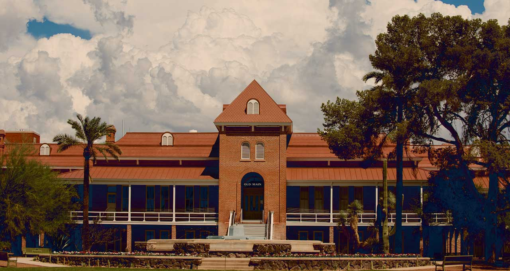

# Open Science Initiatives

## **Unlocking Innovation Through Open Science**

**Collaborate. Share. Advance.**

[**Explore Our Initiatives**](initiatives.md){ .md-button .md-button--primary }

[Precision Health](precision-health.md "Precision Health efforts on campus"){ .md-button }
[Digital Twins](digital-twins.md "Cutting edge simulations and more"){ .md-button }
[Open Data](open-data.md "Data Commons resources on campus"){ .md-button }

---

[**Platforms**](platforms.md){ .md-button .md-button--primary }

[Data Science](data-science.md "Digital literacy and research"){ .md-button }
[Cyberinfrastructure](cloud-computing.md "Cloud Computing and more"){ .md-button }
[Artificial Intelligence](artificial-intelligence "Generative AI and more"){ .md-button }

---

[Resources](resources.md){ .md-button .md-button--primary }

[Documentation](docs.md){ .md-button }
[Training Resources](training-resources.md){ .md-button }
[Community Forums](forums.md "Join discussions with like-minded researchers"){ .md-button }

---

## [Upcoming Events](https://datainsight.arizona.edu/events){target=_blank}

- **Open Science Symposium 2023**  
  November 15, 2023 | 9 AM - 4 PM  
  [Register Now](registration_link)

---

## Stay Updated

Stay updated on the latest in open science by subscribing to our newsletter:

[Subscribe](subscribe_link)
